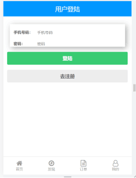
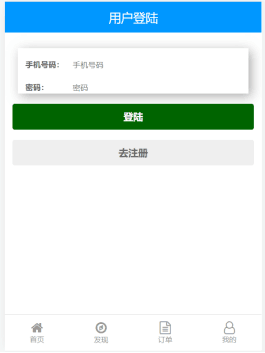
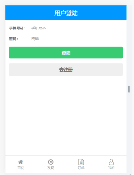
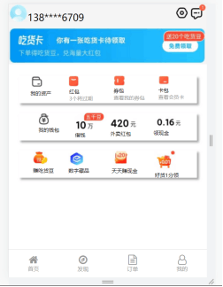
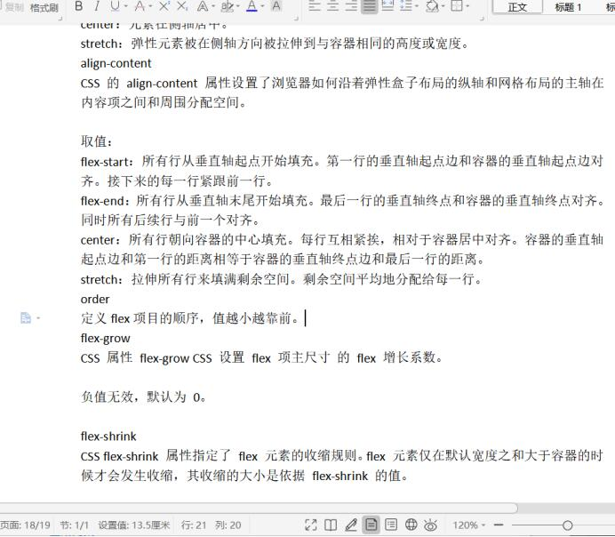

# Soft engineering training assignment elm前端项目描述：

在用户登录界面处，把form表单进行了美化，增加了阴影，并且在鼠标悬停在登录和注册按钮上时，增加了颜色变深的效果，部分代码细节处进行了修改，更加美观。

原来的样子：

根据所学知识，做了一个用户的信息界面（可以通过点击“我的”进行查看），这里面用到了前面所学的知识，使用flex弹性盒子布局，并通过属性设置，以及transform进行位置调整，字体设计制作了以下界面：

界面参考的是我手机上饿了吗app的“我的”界面

同时我在每个版块设计菜单的界面中，增加了script代码，进行页面的跳转
关于“我的页面设计”，html代码可以看“userinformation.html”，css样式可以看“userinfo.css”，
所使用的图片信息，可以看“img/userinfo”文件夹。

下面是我的一些写html和css的一些经验和坑：
html文件在整个文档会从上往下依次渲染
Z-index可以调整叠放顺序，但是对static无效，Position要改为relative
结构调整好，然后再去弄样式，也就是在一开始就先把整个页面的布局弄好，在去写里面的代码，这样逻辑上会清晰一点。
如果连在一起的一系列内部属性可以统一在父节点设置
text-decoration改成none可以去掉连接的下划线
在使用margin时，如果上下两个间距，比如上面一个块margin-bottom是10vm，下面一个margin-top是20vm，那么取的是最大值，不是取的和，但是如果去的是左右，一个margin-left是10vm，另一个是10vm，那么取的就是和，感觉很奇怪，但是事实上确实是这样，所以我的建议是，连在一起的元素只去定义其中一个，不要都定义。

其实下面还有一些知识点的概念，比如和flex相关的各个属性flex-start，flex-end，flex-grow
的值，以及效果，但是内容过多，就不放进这里了。我最想说已经写在了上面

上面是我的Word关于属性知识点的截图。

感觉学习html和css主要还是多去练习，写项目，知识点应该在实践中学习。